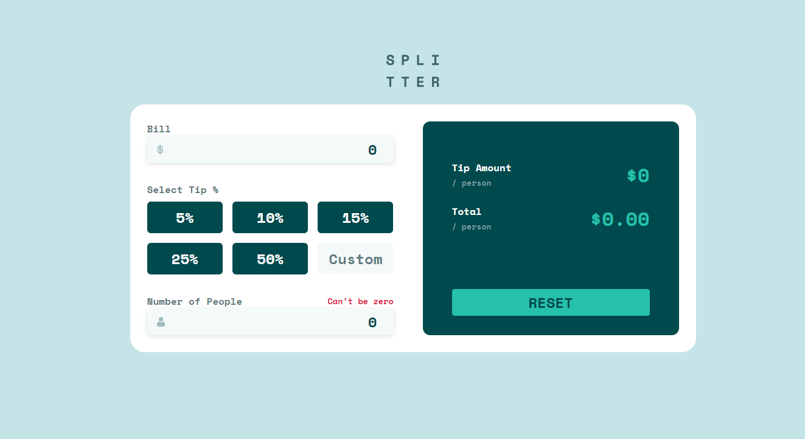

# Frontend Mentor - Tip calculator app solution

This is a solution to the [Tip calculator app challenge on Frontend Mentor](https://www.frontendmentor.io/challenges/tip-calculator-app-ugJNGbJUX). Frontend Mentor challenges help you improve your coding skills by building realistic projects.

## Table of contents

- [Overview](#overview)
  - [The challenge](#the-challenge)
  - [Screenshot](#screenshot)
  - [Links](#links)
- [My process](#my-process)
  - [Approach](#approach)
  - [Built with](#built-with)

## Overview

This a React project is a tip calculator that allows the user to enter the total bill, set the tip percentage using predefined percentage options or write a custom percentage, and specify the number of people. Once the user inputs these values, the calculator will display the total tip for each person and the total bill including the tip.

This project is built using React, a popular JavaScript library for building user interfaces. The user interface is designed to be user-friendly and easy to navigate. The calculator also includes error handling to ensure that the user inputs are valid and the calculation is accurate.

### The challenge

Users should be able to:

- View the optimal layout for the app depending on their device's screen size
- See hover states for all interactive elements on the page
- Calculate the correct tip and total cost of the bill per person

### Screenshot

### Links

- Live Site URL: [Add live site URL here](https://your-live-site-url.com)

## My process

### Approach

This app was created using various React hooks, including the useReducer hook to manage the different states in the application. These hooks are used to handle user actions that modify the state of the app. Additionally, the useRef hook was used to select HTML elements and perform actions on them.

The app is divided into two main components: the inputs section and the display section. This component-based architecture ensures that the app is scalable and easy to maintain.

For styling, Vanilla CSS was chosen as it suited the project's needs, given its relatively small size. However, I plan to refactor the app with SASS or a CSS framework in the future to improve its overall design and user interface.

### Built with

- Semantic HTML5 markup
- Vanilla CSS
- Flexbox
- Mobile-first workflow
- [React](https://reactjs.org/) - JS library
- Vite JS
